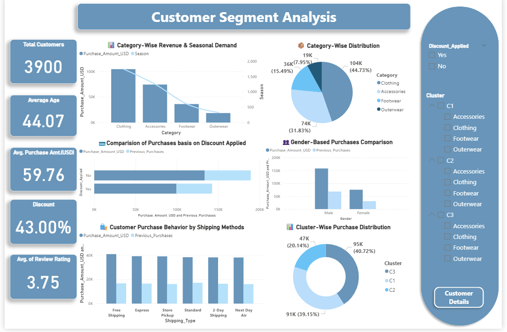

# 📊 Customer-Segment-Analysis
This project analyzes customer purchasing patterns using Power BI to identify revenue-driving product categories, evaluate the impact of discounts, and understand customer segmentation for better marketing strategies.

📈 Key Insights
Customer Overview
The dataset contains 3,900 customers with an average age of 44 years.
The average purchase amount is $59.76, indicating moderate spending behavior.

Category Performance
Clothing contributes the highest revenue share, making it the most profitable category.
Accessories and Footwear generate moderate sales, while Outerwear contributes the least.

Discount Impact
Purchases without discounts generate higher overall purchase value.
Discounts still play a role in encouraging additional purchases and customer engagement.

Gender-Based Purchase Trends
Male customers generate higher purchase amounts compared to female customers.
This highlights opportunities for targeted marketing campaigns.

Shipping Behavior
Free shipping and Express shipping options show higher purchase amounts, indicating convenience plays a key role in purchase decisions.

Customer Segmentation
Cluster C3 represents the largest share of customers (~40%), contributing the highest purchase distribution.
Cluster C1 (~39%) and C2 (~20%) represent additional segments with distinct purchasing patterns.

Customer Satisfaction
The average review rating is 3.75, indicating generally positive customer experiences.
